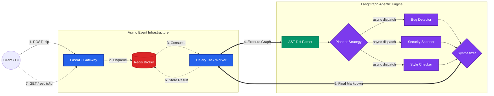

<div align="center">

# 🚀 AutoReviewer: Production-Grade Multi-Agent Code Review System

[](https://github.com/soltaniali/autoreviewer/actions/workflows/ci.yml)
[](https://www.python.org/downloads/)
[](https://fastapi.tiangolo.com/)
[](https://www.docker.com/)
[](https://langchain-ai.github.io/langgraph/)

**Elevate your pull requests with an autonomous squad of expert AI engineers.**

[Features](#-key-features) • [Architecture](#-system-architecture) • [The Agents](#-meet-the-agents) • [Quick Start](#-quick-start) • [Evaluation](#-llm-evaluation--testing)

</div>

---

## 💡 The Vision

Code reviews are critical but time-consuming. **AutoReviewer** goes beyond simple "wrapper" LLM scripts by introducing a highly asynchronous, multi-agent orchestration layer. It evaluates Git diffs and full repositories through the lens of specialized AI agents—filtering out noise, checking for security vulnerabilities, and ensuring architectural alignment—all before a human reviewer even looks at the code.

Constructed with enterprise-grade engineering practices, this system leverages **Celery & Redis** for scalable task queuing, **FastAPI** for high-throughput webhook ingestion, **LangGraph** for multi-agent workflows, and **MLflow** for rigorous LLM evaluation.

---

## ✨ Key Features

*   **🤖 Multi-Agent Orchestration (LangGraph):** A routed workflow of specialized AI agents (Planner, Bug Detector, Security, Style).
*   **⚡ Completely Asynchronous:** Built on FastAPI, Redis, and Celery. Fire-and-forget API drops heavy AI tasks into background queues seamlessly.
*   **🔍 AST-Powered Context Engine:** Intelligently extracts localized AST (Abstract Syntax Tree) contexts from raw diffs to prevent LLM hallucination and manage token limits. 
*   **🛡️ Enterprise Observability:** Fully integrated with **LangSmith** for real-time execution tracing and debugging.
*   **📈 Automated Prompt Evaluation:** Uses **MLflow** LLM-as-a-judge to mathematically score new prompt versions against a "golden dataset" of historical pull requests.
*   **📦 Universal Ingestion:** Supports bare code `.zip` uploads, diff extraction, and full-repository fallback analysis.
*   **🐳 Fully Dockerized:** Spin up the API, Worker, and Redis broker with a single `docker-compose up`.

---

## 🏗 System Architecture

The architecture separates the high-throughput web layer from the blocking nature of LLM inferences, ensuring the system can process hundreds of pull requests concurrently without dropping hooks.



---

## 🧬 Meet the Agents

The system utilizes a directed acyclic graph (DAG) to coordinate responsibilities rather than relying on a single, easily confused LLM prompt:

1.  **The Planner:** 🧭 Reads the initial diff and maps out a strategic review plan. Only activates the necessary downstream agents to save tokens and time.
2.  **Bug Detector:** 🐛 Deep-dives into logic to find edge cases, off-by-one errors, and runtime exceptions.
3.  **Security Scanner:** 🔐 Acts as an AppSec engineer, aggressively hunting for OWASP top 10 vulnerabilities and hardcoded secrets.
4.  **Style Enforcer:** 👔 Checks PEP8 (or language-specific) guidelines, variable naming conventions, and linting rules.
5.  **The Synthesizer (Lead Dev):** 🎯 Consolidates all agent reports, filters out contradictory hallucinations, and formats a beautiful, actionable Markdown report for the final output.

---

## 🚀 Quick Start

### Prerequisites
*   [Docker & Docker Compose](https://docs.docker.com/get-docker/)
*   OpenAI / Anthropic API Key (configurable via environment variables)

### Installation

1. **Clone the repository**
   ```bash
   git clone https://github.com/yourusername/autoreviewer.git
   cd autoreviewer
   ```

2. **Configure Environment Variables**
   ```bash
   cp .env.example .env
   # Add your LLM keys (e.g., OPENAI_API_KEY) and LangSmith API keys to .env
   ```

3. **Spin up the stack**
   ```bash
   docker-compose up --build -d
   ```
   *This starts the FastAPI server on port `8000`, the Redis broker, and the Celery background workers.*

### Usage

**1. Submit a repository for review:**
```bash
curl -X POST "http://localhost:8000/review" \
  -H "accept: application/json" \
  -H "Content-Type: multipart/form-data" \
  -F "file=@/path/to/your/repo.zip"
```
*Response:*
```json
{
  "task_id": "b1a2c3d4-e5f6-7890-abcd-ef1234567890",
  "status": "Task submitted successfully."
}
```

**2. Poll for the final AI synthesis:**
```bash
curl -X GET "http://localhost:8000/results/b1a2c3d4-e5f6-7890-abcd-ef1234567890"
```

---

## 🧪 LLM Evaluation & Testing

We treat our AI prompts as actual software. This repository features an aggressive CI/CD pipeline and mathematical LLM evaluations.

*   **Test Coverage:** Maintained at **>85%** with `pytest` and `pytest-mock`, heavily utilizing Dependency Injection to mock LLM calls.
*   **CI/CD:** GitHub Actions automatically tests every PR.
*   **Prompt Evals:** Run `python eval/mlflow_evaluate.py` to trigger local MLflow deployments. It uses *LLM-as-a-judge* against a golden dataset of past pull requests to ensure our Bug Detector and Security Scanners aren't dropping in accuracy when we tweak the system prompt.

---

## 🤝 Contributing

Contributions are what make the open-source community such an amazing place to learn, inspire, and create. Any contributions you make are **greatly appreciated**.

1. Fork the Project
2. Create your Feature Branch (`git checkout -b feature/AmazingFeature`)
3. Commit your Changes (`git commit -m 'Add some AmazingFeature'`)
4. Push to the Branch (`git push origin feature/AmazingFeature`)
5. Open a Pull Request

---

<div align="center">
  <i>Built with ❤️ by an engineer passionate about Agentic AI.</i>
</div>